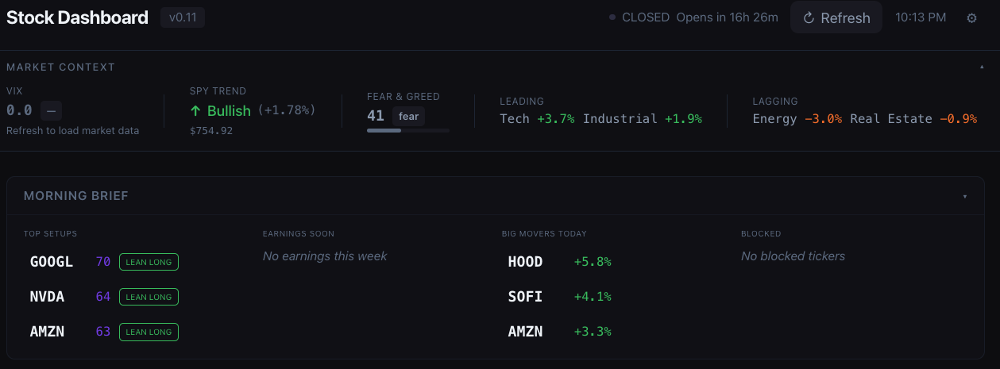
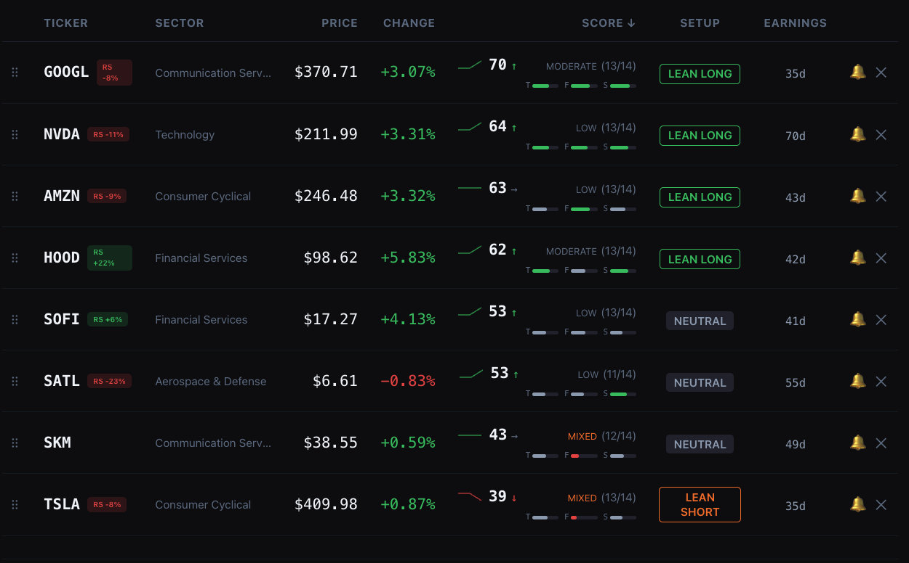
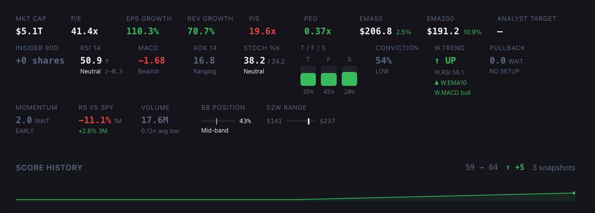
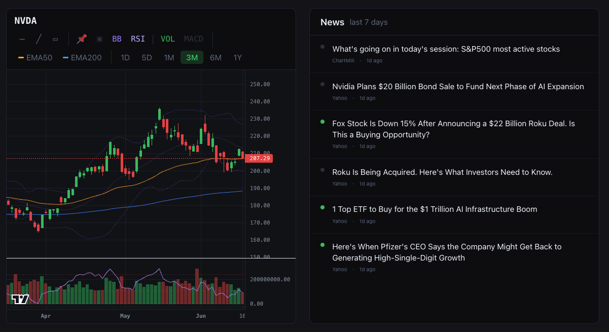

<div align="center">

# 📈 Stock Analysis Dashboard

**A fast, offline-first stock analysis dashboard for retail swing traders.**
Bloomberg-grade data workflow in the browser — no backend, your keys and data never leave your machine.

[](https://hutuleac.github.io/Stock_Anaysis_Dashboard/)
&nbsp;
[](https://github.com/hutuleac/Stock_Anaysis_Dashboard/actions/workflows/deploy.yml)


</div>

---

## Screenshots

> Scan the whole watchlist in the morning, then drill into one name for the full thesis.

**Market context + Morning Brief** — VIX, SPY trend, Fear & Greed, sector leaders/laggards, and the day's top setups / earnings / movers above the fold.


**Watchlist** — every ticker scored 0–100 with a directional badge, T/F/S sub-score bars, conviction %, RS-vs-SPY chip, score sparkline + velocity arrow, and the weekly setup at a glance.


**Fundamentals bar + score history** — valuation (P/E, EPS & rev growth, P/S, PEG), the full indicator suite (RSI, MACD, ADX, Stochastic, BB, EMAs), RS, momentum, weekly trend, conviction, and a 90-day score-history sparkline — each with a plain-English "so what" tooltip.


**Price chart + news** — TradingView candlesticks with EMA50/200, Bollinger Bands, RSI/Volume/MACD sub-panes, and drawing tools, beside a sentiment-tagged 7-day news feed.


---

## Why it exists

Most retail tools either drown you in raw numbers or hide the math behind a black-box "buy/sell" call. This dashboard does the opposite: it computes the indicators **locally from candle data**, scores each name across a dozen signals, and then **explains every score in plain English** — so you learn the *why*, not just the *what*. It runs entirely client-side on a free Finnhub key and deploys as a static site, so there's no server, no subscription, and nothing of yours sent anywhere.

- 🧮 **Transparent scoring** — Technical / Fundamental / Sentiment, regime-aware weights, conviction %, and a thesis you can read.
- ⚡ **Zero-cost data** — built around the Finnhub free tier; indicators computed from candles, not paid endpoints.
- 🔒 **Offline-first & private** — localStorage only; opens instantly from cache, refreshes on demand.
- 🧪 **Tested math** — 163 unit tests over the indicator, scoring, signal, valuation, and chart-anchor engines.

---

## Features

### Watchlist
- Search and add tickers via Finnhub search API
- Bulk import — paste comma/newline-separated list
- Drag-and-drop reorder
- Sort by: score · price · change · earnings · sector · symbol
- Score sparkline — tiny SVG trend line of last 7 score snapshots per ticker
- Score velocity arrow (↑↓→) — 3-day delta
- Price alerts — set above/below targets, notified on next refresh
- CSV export — all tickers with score, sub-scores, price, sector, earnings countdown

### Scoring Engine (up to 12 signals)

| Category | Signals |
|----------|---------|
| **Technical 35%** | EMA50 position, MA200 regime, 52-week range, daily momentum, RSI(14), MACD crossover, ADX trend strength, Stochastic %K momentum |
| **Fundamental 45%** | P/E ratio, EPS growth YoY |
| **Sentiment 20%** | News headline keywords (last 5), sector ETF trend |

- T5 RSI(14) + T6 MACD computed locally from candle data — no extra API key needed
- T7 ADX(14): trend quality signal — strong trending + MACD direction = high conviction
- T8 Stochastic(14,3,3): oversold/overbought zones + %K/%D crossover detection
- EMA50 + MA200 fall back to locally-computed values when Finnhub metrics unavailable
- Optional TwelveData key adds BBands, ADX, Stochastic, and higher-precision indicator values
- Score badges: `STRONG` · `LEAN LONG` · `NEUTRAL` · `LEAN SHORT` · `STRONG SHORT`
- Confidence band: `(factors/total)` shows how many signals had live data
- T/F/S sub-score mini bars inline per row
- **Conviction %** — signal agreement score separate from directional strength ("how bullish" vs "how many signals agree") — HIGH / MODERATE / LOW / MIXED label
- **Regime-aware weights** — VIX > 25: fundamentals 55%, VIX > 35: fundamentals 60%; technicals weighted down in volatile regimes
- **SPY downtrend penalty** — when SPY is in downtrend, all LONG scores pulled 20% toward neutral
- **Fear & Greed modifier** — CNN F&G index adjusts scores at extremes (extreme fear: −3, extreme greed: −2)
- **RSI z-score** — how many std-devs current RSI sits above/below its 90-day mean (shown inline in Fundamentals Bar)
- **Score z-score** — same concept for the composite score itself; shown in table and Fundamentals Bar once ≥5 snapshots exist
- **Weekly Setup Signals (leading)** — two separately-scored entry timers built on weekly candles: **Pullback/Accumulation** (bullish RSI divergence + downtrend exhaustion + volume dry-up) and **Momentum/Breakout** (BB squeeze resolving + structure breakout + volume expansion). Each shows a 0–10 score, readiness (WATCH/SOON/ACT), and an ETA in weeks. Surfaced as a table badge + Fundamentals Bar cells with tooltips. Zero extra API calls.
- **Relative Strength vs SPY (1M/3M)** — stock return minus the index return; outperform/underperform chip on rows + Fundamentals Bar. Leaders keep leading — a core trend-following filter.
- **Growth valuation — Revenue growth · P/S · PEG** — for growth names and ADRs where P/E is negative or misleading. PEG normalizes valuation against growth; P/S works when there are no earnings. Display-only, with plain-English tooltips.
- **EMA Stack** — `BULL STACK` / `BROKEN` chip when price > EMA20 > EMA50 > EMA200 (full bull alignment). The single fastest trend-quality read on a row.
- **Oversold Confluence** — `OVERSOLD` badge when RSI < 35 *and* price sits at/below the lower Bollinger band — a higher-conviction mean-reversion entry than either signal alone.
- **ROC 20d / 60d** — rate-of-change momentum cell; 20d rising while 60d is flat = early trend emergence.
- **52-week-high proximity** — `AT HIGH` / `x% ↓ 52wH` chip flagging breakout-watch candidates near their highs.

### Expanded Row (per ticker, click to open)

**Charts**
- Candlestick chart — 1D / 5D / 1M / 3M / 6M / 1Y (TradingView lightweight-charts)
- MA50 (amber) + MA200 (blue) overlays with toggle button
- **Volume bars** sub-pane (default on) — green/red colored, toggleable
- **MACD** sub-pane (12,26,9) — histogram + line + signal with crossover coloring; exclusive with volume
- **RSI(14)** overlaid on volume/MACD pane — 70/30 reference lines, toggleable
- **Bollinger Bands(20,2)** overlay on main pane — default on, toggleable
- Dynamic chart height adjusts to active sub-panes

**Data panels**
- News panel — last 6 headlines with bull/bear/neutral sentiment dots + timeAgo
- Fundamentals bar — Mkt Cap · P/E · EPS Growth · EMA50 · MA200 · 52w range bar · RSI(14) · MACD · ADX(14) · Stoch %K/%D · BB position · Score Z · Weekly trend · Volume ratio · Conviction %
- **"So what" tooltips** — hover any indicator for plain-English interpretation (e.g. RSI 38 → "approaching oversold; potential base forming")
- Score history chart — full-width SVG with area fill, delta header, 50-point reference line

**Entry Panel** (always visible)
- Thesis Summary — 2–4 plain-English bullets explaining exactly why the score is what it is (positives ▲, negatives ▼, warnings ⚠)
- Trade Window — explicit countdown to earnings with risk colour coding
- High-volatility day warning — fires when |dp| ≥ 5% with contextual copy
- Risk Snapshot — current price, suggested stop (2× weekly ATR), risk/share, risk %
- ATR(14) intraday volatility card — daily noise range reference
- R:R to swing-high target (chartAnchors AVWAP swing high)
- Position sizing — 2% rule: recommended shares, cost, % of portfolio, max loss
- Scenario table — Base (1:2 R:R), Extended (1:3), Stop-out

**Notes**
- Free-text note field per ticker — auto-saves on every keystroke
- 📝 badge on table row when notes exist
- Survives cache clear, persists indefinitely in localStorage

### Market Context Bar
- VIX with plain-English interpretation (CALM → EXTREME)
- SPY trend + 11 sector ETF performance
- **CNN Fear & Greed index** — gauge bar (0–100) with Extreme Fear / Greed labels + nudge integration
- Soft nudge banner for elevated risk conditions
- Collapsible

### App-level
- **Default watchlist** — opens pre-loaded with AMZN · GOOGL · SKM · TSLA · HOOD · NVDA · SOFI; fully editable in Settings (add/remove/reset, persisted separately from active watchlist)
- **Startup hydration** — last fetched data is shown immediately on load from cache; no auto-fetch on open
- Market hours indicator — OPEN/CLOSED + countdown (ET), updates every minute
- Auto-refresh — Off / 5 / 15 / 30 min, only fires when market is open
- Keyboard shortcuts: `R` refresh · `Esc` close · `/` search · `J`/`K` navigate tickers
- Offline banner, storage quota protection, cache-clear in Settings
- GitHub Actions deploy to GitHub Pages on push to `main`

---

## Testing

```bash
npm test          # single run (CI)
npm run test:watch  # watch mode (dev)
```

163 unit tests covering `src/lib/indicators.js`, `src/lib/scoring.js`, `src/lib/signals.js`, `src/lib/valuation.js`, `src/lib/radar.js`, and `src/lib/chartAnchors.js`:

| Suite | What's tested |
|-------|---------------|
| `emaArray` | Seed value, multiplier math, length |
| `computeRSI` | Wilder smoothing, all-gains (100), all-losses (0), edge/null cases |
| `computeMACD` | Structure, histogram = MACD − signal, flat series, crossover detection |
| `computeATR` | Uniform TR, spike isolation, gap-based true range |
| `computeRSIZScore` | Null guard, zero-variance series |
| `computeIndicatorsFromCandles` | All fields returned, BB ordering, missing OHLC graceful null |
| `computeWeeklyTrend` | Up/down trend detection, structure |
| `scoreNewsHeadlines` | Bullish/bearish/neutral words, first-5 limit, clamping |
| `computeScore` | All 8 technical signals, 3 fundamental, regime weights, SPY penalty, F&G modifier, conviction label, badge thresholds |
| `getDaysToEarnings` | Future/past/today date handling |
| `score history` | localStorage store/retrieve, dedup, velocity, z-score |
| `generateThesis` | Structure, EMA50 bull/bear copy, earnings warning |
| `signals.js` | Swing pivots, RSI divergence, BB squeeze, volume profile, structure, both setup aggregators, orchestrator null guards |
| `indicators.js` (RS) | `priceReturn` window math, `computeRelativeStrength` vs SPY (1M/3M), ADX [0,100] bounds |
| `valuation.js` | `computePEG` — ratio math + null guards for zero/negative growth and non-positive P/E |

### Math implementation notes

- **RSI(14)** — Wilder's smoothing (RMA): `avgGain = (prev * 13 + gain) / 14` per bar, consistent with TradingView.
- **EMA** — seeded with SMA of the first `period` values, then standard EMA multiplier `k = 2/(n+1)`.
- **MACD(12,26,9)** — EMA crossover on the MACD histogram (histogram flips sign = crossover event).
- **ATR(14)** — simple average of the last 14 true ranges (not Wilder's RMA). Expect small divergence vs TradingView's ATR(14) which uses Wilder smoothing; values are directionally consistent and suitable for stop-loss guidance.
- **Bollinger Bands(20,2)** — population std dev (divides by `period`, not `period−1`), matching TradingView default.
- **ADX(14)** — Wilder-smoothed +DM/−DM/TR, matching standard ADX definition.
- **Stochastic(14,3,3)** — raw %K smoothed to D by 3-bar SMA; crossover fires on %K/%D sign change.

---

## Setup

1. Get a free API key from [finnhub.io/register](https://finnhub.io/register)
2. *(Optional)* Get a free TwelveData key from [twelvedata.com/register](https://twelvedata.com/register) — unlocks price charts (1D/5D/1M–1Y), RSI/MACD/BBands/ADX/Stochastic precision indicators (8 credits/min, 800/day free tier)
3. Clone and install:
   ```bash
   git clone https://github.com/hutuleac/Stock_Anaysis_Dashboard
   cd Stock_Anaysis_Dashboard
   npm install
   npm run dev
   ```
4. Open `http://localhost:5173` — enter your API key when prompted, then hit Refresh

---

## Tech Stack

| Layer | Choice |
|-------|--------|
| Framework | Svelte 5 (runes — `$state`, `$derived`, `$props`, `$effect`) |
| Build | Vite + Tailwind v4 |
| Charts | TradingView lightweight-charts |
| Data | Finnhub.io free tier + optional TwelveData free tier |
| Storage | localStorage (client-side only, nothing sent to any server) |
| Deploy | GitHub Actions → GitHub Pages |

## Cache TTLs

| Data | TTL |
|------|-----|
| Quotes | No cache (always fresh on refresh) |
| News / Earnings / Candles | 24h |
| Indicators (TwelveData) | 1h |
| Fundamentals / Profile | 7d |

---

## Changelog

### v0.15 (2026-06-20)
- **OBV** — On-Balance Volume with 20-bar EMA trend; Accumulation / Neutral / Distribution cell in Fundamentals Bar.
- **52w-High Volume Confirmation** — breakout chip in the watchlist table now shows `· ↑ vol` / `· low vol` based on recent vs baseline average volume ratio.
- **Swing-Low Support Levels** — S1/S2/S3 pivot lows in Fundamentals Bar (price + % above); SUP toggle on price chart draws dashed green lines.
- **Beta-Adjusted Position Sizing** — tiered risk % (β ≤ 0.8 → 2.5%, normal → 2%, elevated → 1.5%, β > 1.8 → 1%); Entry Panel shows β value colour-coded by tier.
- **Short Interest** — days-to-cover from Finnhub `/stock/short-interest` (free tier); "Short" cell in Fundamentals Bar; 7-day cache.
- 24 new unit tests (187 total); all backlog items 1–5 shipped.

### v0.14 (2026-06-20)
- **Interface cleanup** — removed four features that were non-functional on the Finnhub free tier: **Insider 90d** (endpoint always returned empty), **Pre-Buy Checklist** (friction with no payoff), **Trade Log**, and **Paper Trades** (including the Paper Trades Overview panel and Settings backup). **Replay / Backtest** panel also removed.
- **Entry Panel always unlocked** — no longer gated behind the checklist. Stop-loss input replaced by the ATR-derived suggested stop (2× weekly ATR) which now drives all risk math: risk/share, risk %, position sizing, and the scenario table.
- ~500 lines of dead UI removed; scoring engine, indicators, and test suite unchanged (163 tests).

### v0.13 (2026-06-19)
- **Chart anchors** — four price-anchored signals from one zero-API-call module (`chartAnchors.js`, computed on daily candles). **AVWAP** (anchored to the most significant swing low — institutional cost basis) and **POC + value area** surface as Fundamentals-Bar pills; **Fibonacci retracements** and **Fair Value Gaps** are optional daily-only chart overlays (FIB/FVG toggles). AVWAP-reclaimed + POC-not-below nudge a name's Setup-Radar readiness one tier (WATCH→SOON→ACT); the calibrated `computeScore` and `signals.js` are untouched.
- 19 new unit tests (163 total).

### v0.12 (2026-06-17)
- **Free signal batch** — four zero-API-call signals computed in `computeIndicatorsFromCandles` (52w at display): **EMA Stack** (`BULL STACK`/`BROKEN` chip), **Oversold Confluence** (RSI < 35 + lower-BB badge), **ROC 20d/60d** momentum cell, and **52-week-high proximity** chip. All display-only with tooltips. *Deferred:* the 52w-high volume-confirmation overlay (proximity only for now).
- **ATR-based stop + R:R** — EntryPanel now shows a suggested long stop (entry − 2× *weekly* ATR; weekly over daily so the stop isn't inside the noise on a 2mo–1yr hold) and R:R to the analyst target (keys off the manual stop when set, else the suggested stop; guarded for no-upside/inverted-stop). Daily `atr` exposed from `computeIndicatorsFromCandles`, letting EntryPanel drop its own daily candle fetch — one fewer Finnhub call per ticker.
- 13 new unit tests (136 total).

### v0.11 (2026-06-14)
- **Relative Strength vs SPY (1M/3M)** — each stock's return minus the S&P 500's over ~21 and ~63 trading days; outperform/underperform chip on watchlist rows + Fundamentals Bar cell. SPY daily closes fetched once per refresh (cached).
- **Revenue growth, P/S, PEG** — growth-and-valuation metrics for cases where P/E misleads (growth names, ADRs). Fundamentals Bar cells + "so what" tooltips. PEG computed client-side (`valuation.js`), guarded against zero/negative growth.
- Display-only — no change to the scoring engine. 13 new unit tests (123 total).

### v0.10 (2026-06-14)
- **Weekly Setup Signals** — leading-indicator layer adapted from grid-bot signal research: Pullback (accumulation) and Momentum (breakout) setups scored 0–10 on weekly candles, with readiness (WATCH/SOON/ACT) + ETA in weeks. Surfaced as a table badge and Fundamentals Bar cells with "so what" tooltips. Built from the weekly candles already fetched — no new API calls.
- **Test suite expanded** — 32 new unit tests for `signals.js` (111 total).

### v0.9 (2026-04-01)
- **Paper Trades** — record a hypothetical BUY/SELL, snapshot score + thesis at entry, track live P&L and CONFIRMED/AGAINST verdict over weeks/months; close with exit score snapshot; Paper Trades Overview panel on main dashboard
- **Chart sub-panes** — Volume bars (default on), MACD histogram/line/signal, RSI(14) with 30/70 lines, Bollinger Bands overlay; VOL and MACD are exclusive (one at a time); dynamic chart height
- **Configurable default watchlist** — editable in Settings (chip UI, add/remove/reset); updated to AMZN · GOOGL · SKM · TSLA · HOOD · NVDA · SOFI
- **TwelveData rate limiter** — sliding-window queue (8 calls/min) prevents hitting free tier limits; progressive retry on 429
- **Finnhub 403 tombstone** — restricted endpoints cached for 24h to stop repeated console errors
- **ADR ticker search** — SKM and other ADRs now appear in search results
- **Score arrow/sparkline fix** — shows → flat arrow and center line even with just 1 snapshot; `sv_*` keys now preserved by Clear API Cache

### v0.8 (2026-03-28)
- **Score z-score display** — surfaced in WatchlistTable (desktop, lg+) and Fundamentals Bar; shows how many std-devs current score is above/below its 90-day mean
- **Correlation warning** — Portfolio Stats now flags when 2+ open positions share the same sector with ⚡ warning and plain-English guidance
- **README + changelog** synced to v0.8

### v0.7 (2026-03-28)
- **Mobile card layout** — single-column morning scan mode for < sm breakpoint with expandable rows
- **"So what" tooltips** — hover RSI, MACD, ADX, Stochastic, Conviction, or Score for plain-English interpretation
- **Volume profile** — horizontal histogram SVG overlay on chart right side (toggle ▣ button)
- **Earnings annotations** — past earnings markers on chart coloured by surprise % (fetch from Finnhub `/stock/earnings`)
- **Analyst price target zone** — PT↓ / PT / PT↑ dashed lines on chart from Finnhub price target data
- **Drawing tools** — horizontal line (─), trend line (╱), rectangle (▭) drawn directly on chart and persisted to localStorage per symbol

### v0.6 (2026-03-28)
- **Fear & Greed index** — CNN F&G gauge in Market Context Bar; integrates into score modifier (extreme fear −3, extreme greed −2)
- **SPY downtrend penalty** — when SPY dp < −0.5%, all LONG scores pulled 20% toward neutral; ⚡ shown in table
- **Regime-aware weights** — VIX > 25: fund 55%; VIX > 35: fund 60%; regimeNote shown in thesis + score tooltip
- **Conviction scoring** — signal agreement % separate from directional score; HIGH/MODERATE/LOW/MIXED labels in table + Fundamentals Bar
- **RSI z-score** — 90-day rolling z-score in Fundamentals Bar with "unusually high/low vs history" tooltip

### v0.5 (2026-03-28)
- **Default watchlist** — first-time users see TSLA · SKM · SOFI · GOOGL · AMZN · HOOD immediately; no empty state
- **Startup hydration** — on every open the app loads last-cached quotes, scores, indicators, and news instantly without hitting any API; data only updates when Refresh is clicked
- **Intraday candles** — 1D (1h bars) and 5D (1h bars) timeframes on the price chart with 15-min cache
- **TwelveData as primary chart source** — all 6 timeframes (1D/5D/1M–1Y) via `/time_series`; 365 daily bars fetched once, `setVisibleRange` zooms per timeframe; shared cache eliminates duplicate API calls
- **ADX(14) signal (T7)** — trend strength scoring: strong trending + MACD direction = high conviction; Ranging/Emerging/Trending/Strong pill in Fundamentals Bar
- **Stochastic(14,3,3) signal (T8)** — %K/%D oversold/overbought zones + crossover detection; bull/bear cross badge in Fundamentals Bar
- **EMA50 + MA200 local fallback** — computed from cached candles so Fundamentals Bar always shows values even without Finnhub metrics
- **Credit budget** — 6 indicators × ~6 tickers = 36 credits/refresh (~22 full refreshes/day on free tier)

### v0.4 (2026-03-28)
- **Local RSI(14) + MACD** computed from Finnhub candles — T5/T6 scoring active for all users with no extra API key
- **TwelveData integration** — optional second key adds BB position + higher-precision indicator values; overrides local computation when available
- **ATR(14) volatility card** in Entry Panel — intraday range, stop-too-tight warnings (< 0.5 ATR)
- **High-volatility day warning** — |dp| ≥ 5% nudge in Entry Panel with contextual copy
- **Score history chart** — full-width SVG in expanded row with area fill, delta, 50-pt reference line
- **Edge Analysis** in Portfolio Stats — Expectancy, Kelly %, 5/10 loss streak probability (≥ 5 closed trades)
- **Per-ticker notes** — auto-saved textarea, 📝 badge on table row, survives cache clear

### v0.3 (2026-03-28)
- **Morning Brief** — top setups, earnings warnings, movers, blocked tickers at a glance
- **Thesis Summary** — plain-English score explanation per ticker (bulls ▲, bears ▼, warnings ⚠)
- **Trade Window card** — explicit earnings countdown in Entry Panel with risk colour coding
- **MA50/MA200 overlays** on price chart with toggle
- **Score sparkline** — inline SVG trend chart per row (last 7 snapshots)
- **Sector sort** + sortable Earnings column header
- **Sector concentration risk** warning + exposure breakdown bars
- **Portfolio beta** (weighted) + unrealized P&L in Portfolio Stats
- **BLOCKED badge** wired to hard warning state
- **CSV export** — watchlist with all metrics
- **j/k keyboard navigation** through watchlist rows
- **Auto-refresh** setting (5/15/30 min, market hours only) in Settings

### v0.2 (2026-03-28)
- 9-signal scoring engine (Technical/Fundamental/Sentiment) with T/F/S sub-score bars + velocity
- Candlestick chart (1M–1Y), news panel, fundamentals bar
- Trade log (FIFO P&L + CSV), portfolio stats (win rate, R:R, best/worst)
- Price alerts, bulk import, drag-and-drop reorder
- Market hours indicator, mobile responsive, position sizing (2% rule)
- Stop-loss quick-picks (3/5/8%), portfolio concentration risk

### v0.1 (2026-03-27)
- Watchlist, pre-buy checklist (friction layer), entry panel, market context bar (VIX + sectors)
- 3-signal score, onboarding modal, settings panel, GitHub Pages deploy
