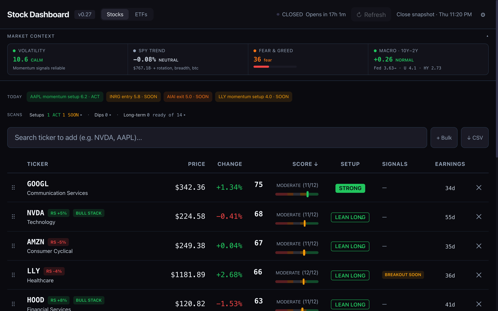
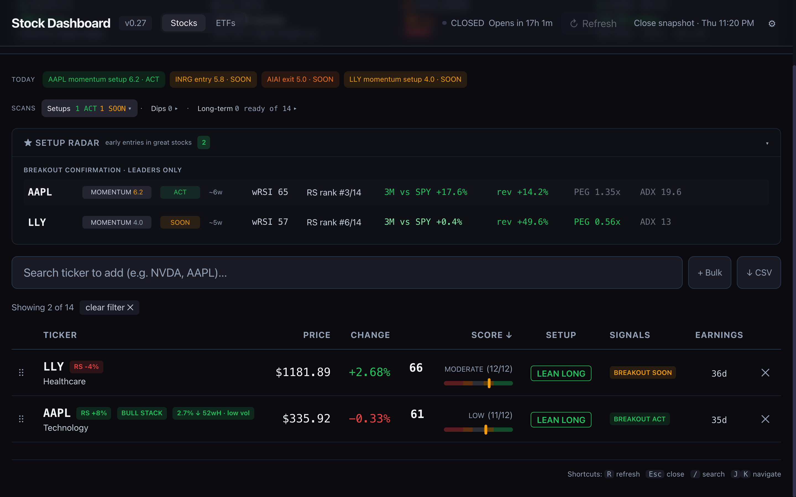
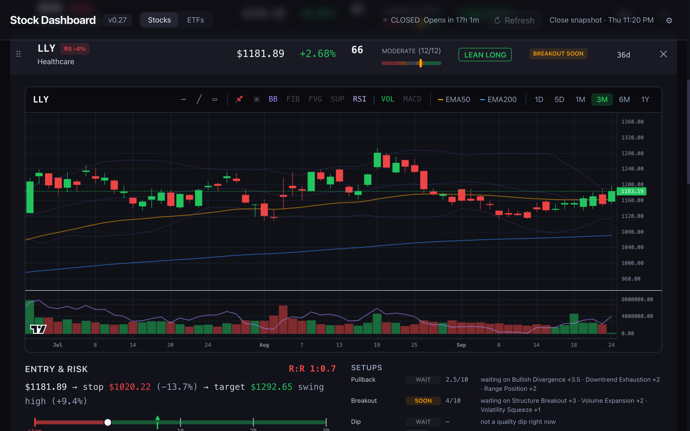
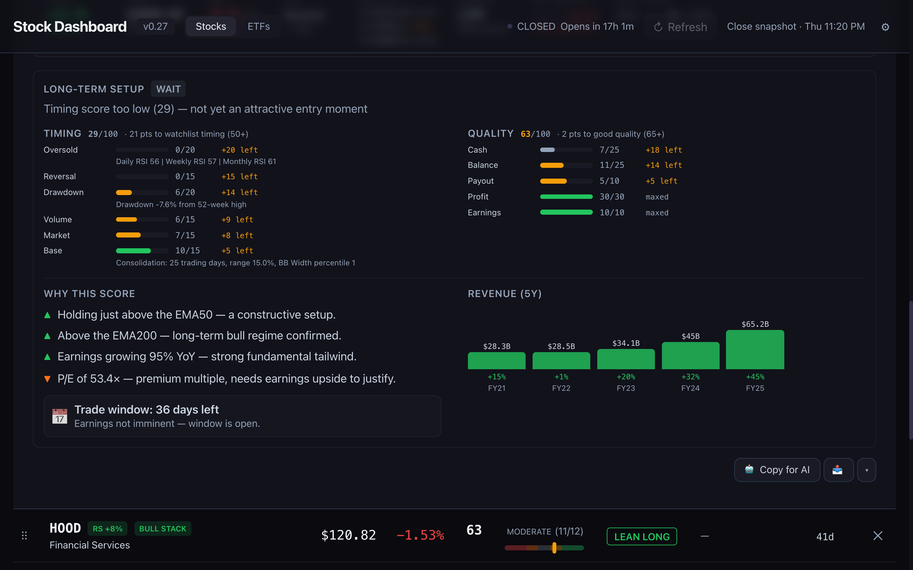
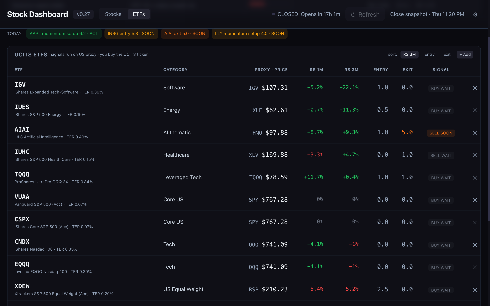
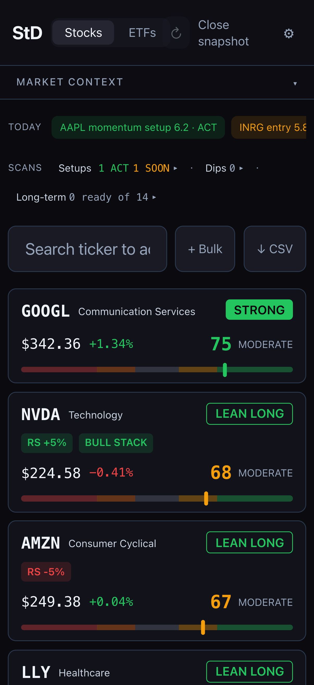
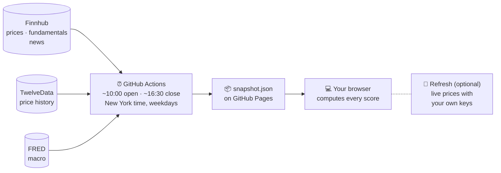
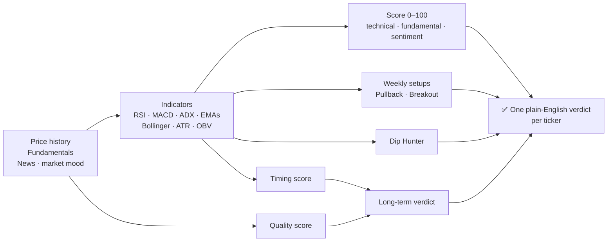

<div align="center">

# 📈 Stock Analysis Dashboard

### Your pre-market analyst, in a browser tab.

Scores every stock on your watchlist, spots entries before they happen,<br/>
and explains every call in plain English. Free, private, no backend.

[](https://hutuleac.github.io/Stock_Anaysis_Dashboard/)
&nbsp;
[](https://github.com/hutuleac/Stock_Anaysis_Dashboard/actions/workflows/deploy.yml)




</div>

---

## ✨ Open it. That's it.

**[→ hutuleac.github.io/Stock_Anaysis_Dashboard](https://hutuleac.github.io/Stock_Anaysis_Dashboard/)**

No account, no API key, no install. A scheduled job refreshes the data **twice every trading day**, around the US open and after the close, so the page opens instantly with real numbers.

Want live prices mid-session? Add your own free API keys in ⚙ Settings and press **Refresh**.

---

## 🎯 What it answers

### "What deserves my attention today?"

The **Today** strip lists every setup that is ready (`ACT`) or close (`SOON`), across stocks and ETFs. The **Scans** line summarises three watchlist-wide radars. Click one to open it, and the table filters to just those tickers.



| Radar | Looks for |
|---|---|
| **Setup Radar** | Weekly **Pullback** (buy weakness before the turn) and **Breakout** (buy strength as a trend starts) setups, each gated on growth and valuation |
| **Dip Hunter** | Quality companies on sale: a strict quality gate first, then a 0–10 dip score (oversold, drawdown, fear, turn, insider buying…) |
| **Long-term** | Accumulation zones where **timing** and **quality** line up at the same time |

### "Is this a good entry, right now?"

Click any row for the deep dive: one verdict sentence, the chart, where your stop and target sit, and which setups are live. Every setup shows what it's still **waiting on**, e.g. `waiting on Structure Breakout +3`.



### "Is it a company worth holding?"

The **Long-Term** card splits the decision into two scores that never blend: **Timing** (is it cheap *now*?) and **Quality** (cash, balance sheet, profit, earnings). Every row shows how many points are left, so a 29 reads as "21 points from the watchlist band" rather than an abstract number. It also shows five years of revenue and a plain-English "why this score".



### "Which ETF do I add, and which do I trim?"

A dedicated view for **Ireland-domiciled UCITS ETFs**, the kind European investors can actually buy. Signals run on the matching US fund (CSPX → SPY, CNDX → QQQ…), and every fund gets an **Entry** and an **Exit** score.



<details>
<summary><b>📱 Works on your phone too</b></summary>
<br/>
<div align="center"></div>
</details>

---

## ⚙️ How it works


```mermaid
flowchart LR
    FH[("Finnhub<br/>prices · fundamentals<br/>news")]
    TD[("TwelveData<br/>price history")]
    FR[("FRED<br/>macro")]
    JOB["⏰ GitHub Actions<br/>~10:00 open · ~16:30 close<br/>New York time, weekdays"]
    SNAP["📦 snapshot.json<br/>on GitHub Pages"]
    YOU["💻 Your browser<br/>computes every score"]
    REF["🔄 Refresh (optional)<br/>live prices with<br/>your own keys"]

    FH --> JOB
    TD --> JOB
    FR --> JOB
    JOB --> SNAP --> YOU
    YOU -.- REF
```

The job runs the dashboard's **own** fetch code, so the snapshot holds exactly what your browser would have cached. Your browser loads it, fills in anything newer it already has, and does all the maths itself: indicators, scores, setups. There is no server.

**From raw data to one verdict:**


```mermaid
flowchart LR
    RAW["Price history<br/>Fundamentals<br/>News · market mood"] --> IND["Indicators<br/>RSI · MACD · ADX · EMAs<br/>Bollinger · ATR · OBV"]
    IND --> SC["Score 0–100<br/>technical · fundamental · sentiment"]
    IND --> SU["Weekly setups<br/>Pullback · Breakout"]
    IND --> DIP["Dip Hunter"]
    IND --> TI["Timing score"]
    RAW --> QU["Quality score"]
    TI --> LT["Long-term verdict"]
    QU --> LT
    SC --> V["✅ One plain-English verdict<br/>per ticker"]
    SU --> V
    DIP --> V
    LT --> V
```

The score adapts to the market: in high volatility it leans on fundamentals, a falling S&P 500 pulls bullish scores toward neutral, and extreme fear or greed nudges them. A **conviction** figure shows how many signals agree, which is separate from how bullish the score is.

---

## 💸 Runs entirely on free tiers

| Provider | Free limit | The scheduled job uses | Your Refresh uses |
|---|---|---|---|
| [Finnhub](https://finnhub.io/register) | 60 calls/min | ~140 at close, ~26 at open | ~26 price calls (~34 s) |
| [TwelveData](https://twelvedata.com/register) | 800/day · 8/min | ~26 at close | 0 (price history comes from the snapshot) |
| [FRED](https://fred.stlouisfed.org/docs/api/api_key.html) | 120/min | 5 per deploy | 0 |

---

## 🚀 Get started

**1 · Just use it.** Open the [live dashboard](https://hutuleac.github.io/Stock_Anaysis_Dashboard/). No keys needed.

**2 · Go live.** Get free [Finnhub](https://finnhub.io/register) and [TwelveData](https://twelvedata.com/register) keys, paste them into ⚙ Settings, and press **Refresh** (or `R`). Keys stay in your browser and are only ever sent to those two providers.

**3 · Run your own copy.** Fork the repo, then:

1. Put your tickers in [`watchlist.json`](watchlist.json). That is the list the job snapshots.
2. Add three repo secrets: `FINNHUB_API_KEY`, `TWELVEDATA_API_KEY`, `FRED_API_KEY`.
3. Set **Settings → Pages → Source** to *GitHub Actions*.
4. In `.github/workflows/deploy.yml`, point `LIVE_URL` at your own Pages URL.
5. Run the workflow once (`gh workflow run deploy.yml`). After that the schedule takes over.

**Develop locally:**

```bash
git clone https://github.com/hutuleac/Stock_Anaysis_Dashboard
cd Stock_Anaysis_Dashboard
npm install
npm run dev     # http://localhost:5173 (demo data until you add keys)
npm test        # 534 unit tests, ~1 s
```

---

## 🔒 Privacy, honestly

- **Your keys** live in your browser's localStorage and go only to Finnhub and TwelveData.
- **Your watchlist and settings** never leave your browser.
- **The published snapshot** (the tickers in `watchlist.json`) is public, like the site itself.
- No analytics, no tracking, no server of our own.

---

## ⌨️ Handy extras

- **Keyboard**: `R` refresh · `/` search · `J` `K` move between tickers · `Esc` close
- **🤖 Copy for AI**: turns the full reading of a ticker into a ready-to-paste prompt (editable templates in Settings), with a share-sheet button on mobile
- **CSV export**, bulk ticker import, drag-and-drop ordering
- **Auto-refresh** every 5 / 15 / 30 min while the market is open
- **Notifications** for new `ACT` / `SOON` signals (opt-in)

---

## 🧰 Under the hood

| Layer | Choice |
|---|---|
| Framework | Svelte 5 (runes) |
| Build | Vite 8 + Tailwind v4 |
| Charts | TradingView lightweight-charts v5 |
| Data | Finnhub + TwelveData + FRED free tiers |
| Storage | Browser localStorage only |
| Hosting | GitHub Pages, deployed and snapshotted by GitHub Actions |
| Tests | Vitest: 534 tests over every engine (indicators, scoring, setups, dips, ETFs, long-term, snapshot) |

<details>
<summary><b>Indicator maths notes</b></summary>

- **RSI(14)**: Wilder smoothing, matches TradingView. A flat series reads 50, not 100.
- **EMA**: SMA seed for the first `period` values, then `k = 2/(n+1)`.
- **MACD(12,26,9)**: a crossover is a histogram sign flip.
- **ATR(14)**: simple average of 14 true ranges, not Wilder. It diverges slightly from TradingView; fine for stop placement.
- **Bollinger Bands(20,2)**: population standard deviation, matches TradingView.
- **ADX(14)**: full Wilder-smoothed +DM/−DM/TR pipeline, bounded 0–100.
- **Stochastic(14,3,3)**: raw %K, 3-bar SMA for %D.

</details>

---

<div align="center">

**[Changelog](CHANGELOG.md)** · **[Latest QA report](docs/QA_2026-09-24_improvements.md)** · **[Backlog](BACKLOG.md)**

<sub>Built for learning and decision support. Not financial advice: always do your own research.</sub>

</div>
